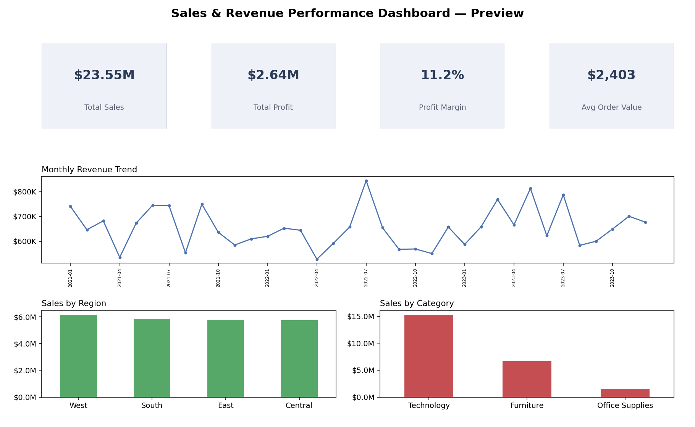
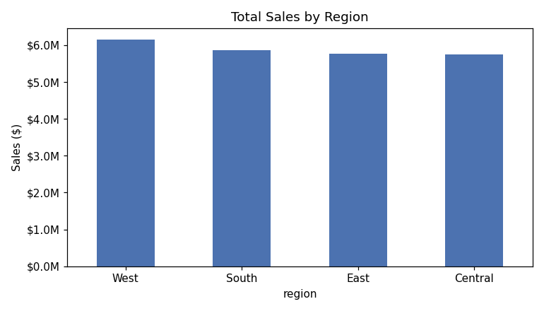
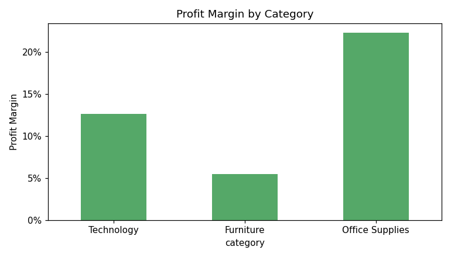
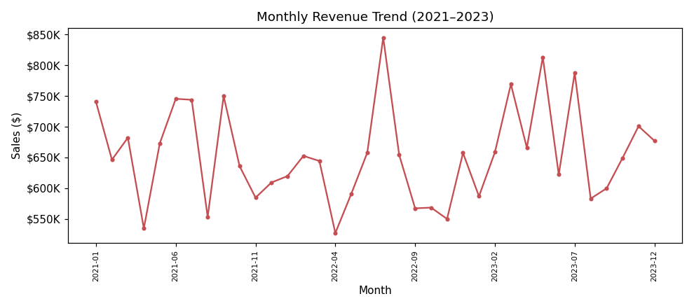
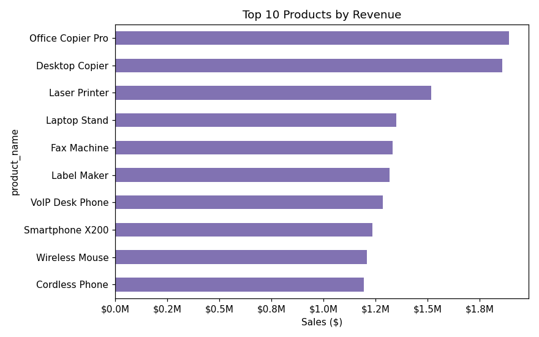

# Sales and Revenue Performance Dashboard

An end-to-end analytics project that cleans, models, and analyzes retail
transaction data to surface sales trends, profitability drivers, regional
performance, and top-product/customer behavior — packaged as SQL analysis,
a Python/pandas notebook, and a Power BI-style dashboard.



## Project Overview

This project analyzes multi-year retail sales and revenue performance to
identify business trends, top-performing products and regions, profitability
patterns, and actionable insights for decision-making. It walks through the
full analytics workflow a Data/BI Analyst would follow in industry: loading
raw transactional data, cleaning and modeling it, writing SQL and Python
analysis, and presenting results through KPIs and dashboard visuals.

## Business Problem

Retail and sales organizations generate large volumes of transactional data
but often struggle to convert it into decisions. This project addresses:

- Understanding overall sales and revenue performance across time
- Tracking revenue growth or decline month over month
- Identifying which products and categories are genuinely profitable
- Evaluating how much each region contributes to total revenue
- Monitoring core KPIs (sales, profit, margin, order value) in one place

## Objectives

- Analyze total sales, revenue, and profit trends over time
- Compare region-wise and category-wise performance
- Identify top-performing and low-margin products
- Evaluate monthly and quarterly sales performance
- Build an interactive dashboard for decision-making
- Generate business insights and recommendations grounded in the data

## Dataset Information

- **Source:** Synthetically generated retail transactions dataset, modeled
  after the structure of the well-known "Superstore" sales dataset commonly
  used in BI portfolios. Generated for this project via
  [`scripts/generate_raw_data.py`](scripts/generate_raw_data.py) so the full
  pipeline — including realistic data-quality issues — is reproducible from
  scratch.
- **Size:** 9,947 raw transaction line-items → 9,802 rows after cleaning,
  spanning January 2021 – December 2023.
- **Key columns:** `order_id`, `order_date`, `ship_date`, `ship_mode`,
  `customer_id`, `customer_name`, `segment`, `region`, `city`, `state`,
  `postal_code`, `category`, `sub_category`, `product_id`, `product_name`,
  `sales`, `quantity`, `discount`, `profit`.
- **Derived fields:** `profit_margin`, `order_year`, `order_month`,
  `order_year_month`.
- **Note:** Because the source data is synthetically generated, absolute
  dollar figures are illustrative rather than real-world sales figures. The
  relationships in the data (category margins, regional spread, product
  concentration) are intentionally realistic so the analysis technique is
  representative of real BI work.

## Tools & Technologies Used

- **Power BI** — dashboard data model, measures, and page layout ([`dashboard/`](dashboard/))
- **SQL (SQLite-compatible)** — KPI and trend analysis queries ([`sql/`](sql/))
- **Python / pandas** — data generation, cleaning, and EDA
- **Jupyter Notebook** — exploratory analysis and chart generation
- **Matplotlib** — chart/visual generation
- **Excel/CSV** — raw and processed data storage
- **Git / GitHub** — version control and portfolio hosting

## Project Workflow / Methodology

1. **Data generation/collection** — raw transactional export (`data/raw/`)
2. **Data cleaning** — standardize schema, parse dates, dedupe, impute (`scripts/clean_data.py`)
3. **Data preparation** — load cleaned data into SQLite for SQL analysis (`scripts/build_sqlite_db.py`)
4. **Exploratory analysis** — pandas/matplotlib EDA (`notebooks/sales_revenue_analysis.ipynb`)
5. **KPI analysis** — SQL scripts computing headline and segmented metrics (`sql/`)
6. **Dashboard development** — Power BI data model, measures, and layout (`dashboard/`)
7. **Insight generation** — key findings and business recommendations (below)

## Data Cleaning & Preparation

Implemented in [`scripts/clean_data.py`](scripts/clean_data.py):

- Standardized all column names to `snake_case`
- Parsed inconsistent date formats (`YYYY-MM-DD`, `MM/DD/YYYY`, `DD-MM-YYYY`, `MM/DD/YY`) into a single datetime type
- Normalized inconsistent text casing in `category` and `region` (e.g. `"TECHNOLOGY"`, `"west"`)
- Removed 145 exact duplicate transaction rows
- Imputed 98 missing `profit` values using the sub-category median
- Converted blank postal codes to proper nulls
- Added calculated fields: `profit_margin`, `order_year`, `order_month`, `order_year_month`

## Key KPIs Tracked

Computed in [`sql/02_kpi_summary.sql`](sql/02_kpi_summary.sql) and the notebook:

| KPI | Value |
|---|---|
| Total Sales | $23,546,384.85 |
| Total Profit | $2,641,984.25 |
| Overall Profit Margin | 11.2% |
| Total Orders | 9,800 |
| Average Order Value | $2,402.69 |
| Total Customers | 248 |
| Total Units Sold | 64,021 |

Also tracked: monthly sales trend, region-wise revenue/margin, category and
sub-category revenue/margin, top 10 products and customers by revenue.

## Dashboard Features

Documented in [`dashboard/README.md`](dashboard/README.md), the dashboard is
designed across three pages:

- **Executive Overview** — KPI cards, monthly revenue trend, sales by region, sales by category, with slicers for date range / region / category / segment
- **Product & Category Analysis** — top 10 products by revenue, sub-category profitability table, high-volume/low-margin product flagging
- **Customer & Regional Analysis** — top 10 customers by lifetime revenue, region × category cross-tab, segment breakdown

## SQL / Python Analysis Summary

- [`sql/01_schema.sql`](sql/01_schema.sql) — table DDL for the cleaned dataset
- [`sql/02_kpi_summary.sql`](sql/02_kpi_summary.sql) — headline KPI calculation
- [`sql/03_regional_category_analysis.sql`](sql/03_regional_category_analysis.sql) — revenue/profit/margin by region, category, and sub-category
- [`sql/04_top_products_customers.sql`](sql/04_top_products_customers.sql) — top products, high-volume/low-margin products, top customers
- [`sql/05_monthly_trend.sql`](sql/05_monthly_trend.sql) — monthly and quarterly trend, month-over-month growth rate
- [`notebooks/sales_revenue_analysis.ipynb`](notebooks/sales_revenue_analysis.ipynb) — the same analyses performed in pandas, with chart generation and a written insights summary

All SQL scripts were validated by loading the cleaned dataset into a local
SQLite database (`scripts/build_sqlite_db.py`) and executing each query.

## Key Insights

Derived directly from the SQL/notebook analysis (see figures above):

- **Technology drives revenue.** Technology is the largest category by
  revenue ($15.27M, ~65% of total sales) and carries a healthy 12.6% margin.
- **Furniture is a profitability concern.** Furniture generates substantial
  revenue ($6.72M) but the weakest margin of the three categories (5.5%) —
  the largest gap between sales volume and profitability in the dataset.
- **Office Supplies is efficient but underleveraged.** It has the highest
  profit margin (22.3%) of any category despite the smallest revenue share
  ($1.55M), suggesting room to grow volume without hurting profitability.
- **Regional performance is fairly balanced.** West leads ($6.16M) but all
  four regions fall within a similar band ($5.75M–$6.16M) — no single region
  is significantly underperforming.
- **A small set of high-volume products carry thin margins** (see
  `sql/04_top_products_customers.sql` and notebook section 6), making them
  better candidates for a targeted pricing/cost review than a blanket,
  category-wide discount change.

## Business Recommendations

- Review Furniture pricing and supplier/unit costs — it is the category with
  the widest gap between revenue contribution and profit margin.
- Test increasing marketing/promotional investment in Office Supplies, where
  margin is strongest but revenue share is smallest.
- Apply a targeted review (rather than broad discounting) to the specific
  high-volume, low-margin products flagged in the analysis.
- Continue balanced regional investment — no single region needs
  reallocation of resources based on current performance.
- Track month-over-month growth rate (computed in `sql/05_monthly_trend.sql`)
  as a leading indicator rather than relying on cumulative totals alone.

## Folder Structure

```
sales-revenue-performance-dashboard/
├── README.md
├── LICENSE
├── requirements.txt
├── .gitignore
├── data/
│   ├── raw/                 # original (messy) generated export
│   └── processed/           # cleaned dataset + SQLite db (db is gitignored)
├── sql/                      # KPI and trend analysis SQL scripts
├── notebooks/                # EDA / KPI Jupyter notebook
├── scripts/                  # data generation, cleaning, and build scripts
├── dashboard/                # Power BI data model, measures, layout notes
└── images/                   # exported charts + dashboard preview
```

## How to Run / Use the Project

1. **Install dependencies**
   ```bash
   pip install -r requirements.txt
   ```
2. **Regenerate the dataset (optional — a copy is already included)**
   ```bash
   python scripts/generate_raw_data.py
   python scripts/clean_data.py
   ```
3. **Run the SQL analysis**
   ```bash
   python scripts/build_sqlite_db.py
   # then run the queries in sql/*.sql against data/processed/sales.db
   # using any SQLite client, or Python's sqlite3 module
   ```
4. **Explore the notebook**
   ```bash
   jupyter notebook notebooks/sales_revenue_analysis.ipynb
   ```
5. **Review the dashboard design**
   Open [`dashboard/README.md`](dashboard/README.md) for the data model and
   measures, and rebuild in Power BI Desktop using
   `data/processed/sales_data_clean.csv` as the source.
6. **View the exported visuals**
   See the `images/` folder for standalone charts and the full dashboard preview.

## Screenshots / Dashboard Preview

| Preview | Description |
|---|---|
|  | Full KPI + chart dashboard preview |
|  | Regional sales comparison |
|  | Category profitability comparison |
|  | Revenue trend, 2021–2023 |
|  | Top 10 products by revenue |

## Skills Demonstrated

- Data cleaning and preparation (nulls, duplicates, mixed formats, type standardization)
- Relational data modeling for BI consumption
- SQL querying (aggregation, window functions, CTEs, having clauses)
- KPI definition and reporting
- Dashboard design and measure definition (Power BI/DAX)
- Trend and time-series analysis
- Business insight generation and recommendation writing
- Python/pandas data analysis and visualization
- Git version control and technical documentation

## Resume Highlights

- Built an end-to-end sales and revenue analytics pipeline (data cleaning →
  SQL/Python analysis → BI dashboard) covering ~9,800 transactions across 3
  years, 4 regions, and 3 product categories.
- Wrote SQL analysis scripts (aggregation, window functions, CTEs) to
  calculate KPIs including revenue, profit margin, average order value, and
  month-over-month growth rate.
- Designed a Power BI-ready data model and 3-page dashboard layout (executive
  overview, product analysis, customer/regional analysis) with reusable DAX measures.
- Identified category-level profitability gaps and high-volume/low-margin
  products, translating analysis into concrete pricing and investment recommendations.
- Automated a reproducible data cleaning pipeline in Python/pandas, resolving
  mixed date formats, duplicate records, and missing values.

## Future Improvements

- Connect the dashboard to a live/refreshable data source instead of a static CSV extract
- Add customer cohort/retention analysis
- Add a forecasting component (e.g. moving average or simple time-series model) for revenue projection
- Expand regional analysis to city/state-level granularity with a map visual
- Add automated data-quality tests (e.g. `pytest` + `great_expectations`) to the cleaning pipeline
